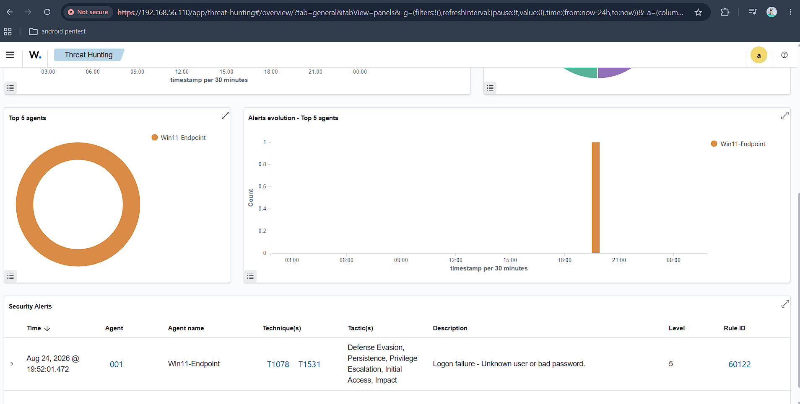
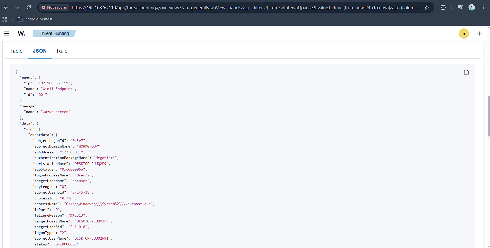

# Building a Virtual SOC Lab with Wazuh SIEM

## 📌 Project Overview
Designed and deployed a self-hosted SIEM environment using **Wazuh** on Ubuntu Server to monitor telemetry, investigate Windows event logs, and analyze real-time security alerts.

---

## 🏗️ Lab Architecture & Network Layout
* **SIEM Server (Manager & Dashboard):** Ubuntu Server (`192.168.56.110`)
* **Target Endpoint:** Windows 11 (`192.168.56.111`) — *Wazuh Agent 001*
* **Hypervisor:** Oracle VirtualBox (Host-Only Adapter Subnet `192.168.56.0/24`)

---

### Scenario 1: Authentication Failure (Logon Anomaly)

* **Objective:** Verify real-time Windows Event Log ingestion and analyze authentication failure telemetry.
* **Simulated Action:** Generated interactive logon failures on the target Windows 11 endpoint.
* **MITRE ATT&CK Mapping:** Credential Access — [T1078 (Valid Accounts)](https://attack.mitre.org/techniques/T1078/) / [T1110 (Brute Force)](https://attack.mitre.org/techniques/T1110/)

#### Visual Evidence & Verification

*Figure 1.1: Wazuh SIEM alerting on Windows Event ID 4625 via Rule 60122.*

*Figure 1.2: Raw JSON event payload revealing interactive logon failure telemetry.*

#### Key Telemetry Extracted
* **Target User:** `socuser` (`data.win.eventdata.targetUserName`)
* **Logon Type:** `2` (Interactive / Keyboard login at physical machine)
* **SubStatus Code:** `0xc000006a` (Windows NTSTATUS code: *Valid Username, Bad Password*)
* **Workstation:** `DESKTOP-JUUQ2F9`
* **Calling Process:** `C:\Windows\System32\svchost.exe`

---

## 📝 SOC Incident Report Summary

| Field | Details |
| :--- | :--- |
| **Incident Title** | Failed Logon Attempt Detected |
| **Target Host** | `Win11-Endpoint` (`192.168.56.111`) |
| **Alert ID & Severity** | Rule `60122` — Level 5 |
| **Triage Notes** | Single failed logon attempt detected. Inspected raw telemetry payload; no brute-force cluster or follow-up privilege escalation observed. |
| **Verdict** | **False Positive (Benign User Error)** |
