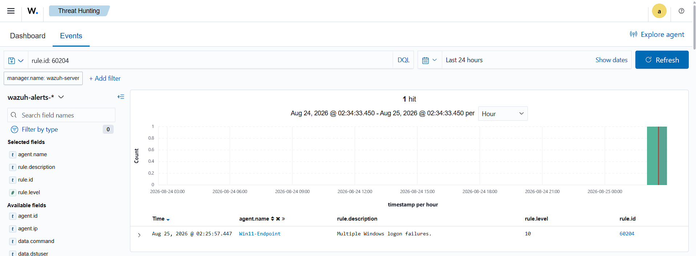
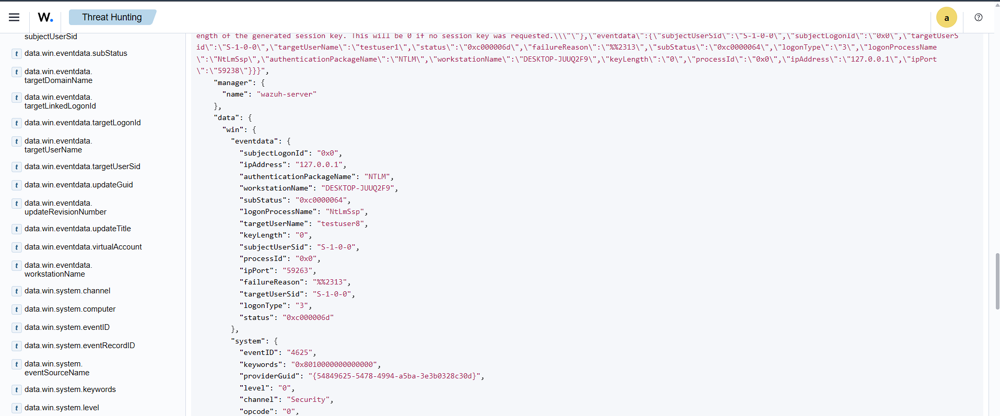

# Building a Virtual SOC Lab with Wazuh SIEM

## 📌 Project Overview
Designed and deployed a self-hosted SIEM environment using **Wazuh** on Ubuntu Server to monitor telemetry, investigate Windows event logs, and analyze real-time security alerts.

---

## 🏗️ Lab Architecture & Network Layout
* **SIEM Server (Manager & Dashboard):** Ubuntu Server (`192.168.56.110`)
* **Target Endpoint:** Windows 11 (`192.168.56.111`) — *Wazuh Agent 001*
* **Hypervisor:** Oracle VirtualBox (Host-Only Adapter Subnet `192.168.56.0/24`)

---

### Scenario 1: Authentication Failure (Logon Anomaly)

* **Objective:** Verify real-time Windows Event Log ingestion and analyze authentication failure telemetry.
* **Simulated Action:** Generated interactive logon failures on the target Windows 11 endpoint.
* **MITRE ATT&CK Mapping:** Credential Access — [T1078 (Valid Accounts)](https://attack.mitre.org/techniques/T1078/) / [T1110 (Brute Force)](https://attack.mitre.org/techniques/T1110/)

#### Visual Evidence & Verification

*Figure 1.1: Wazuh SIEM alerting on Windows Event ID 4625 via Rule 60122.*

*Figure 1.2: Raw JSON event payload revealing interactive logon failure telemetry.*

#### Key Telemetry Extracted
* **Target User:** `socuser` (`data.win.eventdata.targetUserName`)
* **Logon Type:** `2` (Interactive / Keyboard login at physical machine)
* **SubStatus Code:** `0xc000006a` (Windows NTSTATUS code: *Valid Username, Bad Password*)
* **Workstation:** `DESKTOP-JUUQ2F9`
* **Calling Process:** `C:\Windows\System32\svchost.exe`

---

## 📝 SOC Incident Report Summary

| Field | Details |
| :--- | :--- |
| **Incident Title** | Authentication Anomaly — Windows Failed Logon |
| **Target Host** | `Win11-Endpoint` (`192.168.56.111`) |
| **Alert ID & Severity** | Rule 60122 (Level 5) , Windows Event ID 4625 |
| **Target User & Vector** | User: socuser , Logon Type: 2 (Interactive / Local Console) |
| **MITRE ATT&CK** | T1078 - Valid Accounts / T1110 - Brute Force |
| **Triage Notes** | Single isolated failed logon. Inspected raw telemetry payload (subStatus: 0xc000006a); confirmed valid username with incorrect password entry. No brute-force cluster or follow-up process execution (Event ID 4688) observed. |
| **Verdict** | **False Positive (Benign User Typo)** — Closed ticket; no host containment required. |

---

### 🚨 Scenario 2: High-Velocity Brute-Force Detection & Correlation

#### 1. Threat Overview & Objective
* **Objective:** Validate SIEM frequency correlation rules against automated, multi-account password-guessing attacks.
* **Simulated Attack:** Executed a high-velocity PowerShell script generating 15 sequential authentication failures across dynamically generated account names (`testuser1` through `testuser15`).
* **MITRE ATT&CK Mapping:** Credential Access — [T1110.001 (Password Guessing)](https://attack.mitre.org/techniques/T1110/001/)

#### 2. Visual Detection Evidence

*Figure 2.1: Wazuh SIEM escalating isolated logon failures to Rule 60204 (Level 10).*

*Figure 2.2: Raw JSON payload displaying NTLM network authentication failure details.*

#### 3. Key Telemetry Extracted
* **Correlated Rule:** `60204` (Level 10 — *Multiple Windows logon failures*)
* **Event ID:** `4625`
* **Logon Type:** `3` (Network Authentication / SMB)
* **Authentication Provider:** `NtLmSsp`
* **SubStatus Code:** `0xc0000064` (*Unknown Username / Account Does Not Exist*)
* **Target Sample:** `testuser8`

#### 4. Incident Summary Table

| Field | Details |
| :--- | :--- |
| **Incident Title** | High-Velocity Brute-Force / Credential Spray Attack |
| **Target Host** | `Win11-Endpoint` (`192.168.56.111`) |
| **Alert ID & Severity** | Rule `60204` — Level 10 |
| **Triage Notes** | Observed rapid succession of Event ID `4625` entries with `LogonType: 3` and `SubStatus: 0xc0000064`. Account names iterated sequentially, confirming automated dictionary/guessing attempt. |
| **Verdict** | **True Positive (Simulated Attack)** — High-severity alert validated; host flagged for automated active response containment. |
